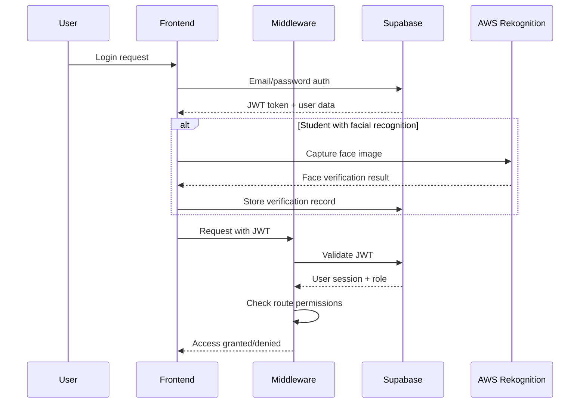

# Examica Architecture Documentation

This document outlines the technical architecture, design decisions, and system components for the Examica examination platform.

## System Overview

Examica is built as a modern, scalable web application using a serverless-first architecture with strong security and real-time capabilities.

### Architecture Diagram

```
┌─────────────────────────────────────────────────────────────────┐
│                          Frontend Layer                          │
│  ┌─────────────────┐  ┌─────────────────┐  ┌─────────────────┐ │
│  │   Admin Panel   │  │ Examiner Portal │  │ Student Portal  │ │
│  │                 │  │                 │  │                 │ │
│  └─────────────────┘  └─────────────────┘  └─────────────────┘ │
│                    Next.js App Router                           │
└─────────────────────────────────────────────────────────────────┘
                                 │
                                 │ HTTPS/WebSocket
                                 ▼
┌─────────────────────────────────────────────────────────────────┐
│                        API & Middleware                         │
│  ┌─────────────────┐  ┌─────────────────┐  ┌─────────────────┐ │
│  │  Auth Middleware │  │   Rate Limiting  │  │   CORS Handler   │ │
│  └─────────────────┘  └─────────────────┘  └─────────────────┘ │
│                     Next.js API Routes                          │
└─────────────────────────────────────────────────────────────────┘
                                 │
                ┌────────────────┼────────────────┐
                ▼                ▼                ▼
┌─────────────────┐  ┌─────────────────┐  ┌─────────────────┐
│   Supabase      │  │   AWS Services   │  │   AI Services   │
│                 │  │                 │  │                 │
│  ┌─────────────┐│  │  ┌─────────────┐│  │  ┌─────────────┐│
│  │ PostgreSQL  ││  │  │ Rekognition ││  │  │   OpenAI    ││
│  │ Database    ││  │  │   (Facial)  ││  │  │   Claude    ││
│  └─────────────┘│  │  └─────────────┘│  │  └─────────────┘│
│  ┌─────────────┐│  │  ┌─────────────┐│  │                 │
│  │    Auth     ││  │  │     S3      ││  │                 │
│  │   Service   ││  │  │  (Storage)  ││  │                 │
│  └─────────────┘│  │  └─────────────┘│  │                 │
│  ┌─────────────┐│  │                 │  │                 │
│  │Real-time DB ││  │                 │  │                 │
│  │Subscriptions││  │                 │  │                 │
│  └─────────────┘│  │                 │  │                 │
└─────────────────┘  └─────────────────┘  └─────────────────┘
```

## Technology Stack Details

### Frontend Technology Stack

#### Next.js 14+ (App Router)
- **Rationale**: Server-side rendering for better performance, built-in API routes, excellent TypeScript support
- **Features Used**: App Router, Server Components, Client Components, API routes, Middleware
- **Configuration**: TypeScript, ESLint, Prettier integrated

#### React 18+
- **State Management**: React Context API + useReducer for complex state
- **Component Architecture**: Composition pattern with custom hooks
- **Performance**: React.memo, useMemo, useCallback for optimization

#### Tailwind CSS
- **Rationale**: Utility-first CSS, responsive design, consistent design system
- **Configuration**: Custom theme, component classes, dark mode support
- **Architecture**: Atomic design principles with utility classes

#### TypeScript
- **Configuration**: Strict mode enabled, absolute imports configured
- **Type Safety**: Comprehensive type definitions for all data models
- **Integration**: Full stack type safety from database to UI

### Backend & Infrastructure

#### Supabase (Backend-as-a-Service)
```typescript
// Supabase Configuration Structure
interface SupabaseConfig {
  database: {
    type: 'PostgreSQL',
    features: ['RLS', 'Real-time subscriptions', 'Full-text search']
  },
  authentication: {
    providers: ['Email', 'OAuth'],
    security: ['JWT', 'Row Level Security']
  },
  storage: {
    buckets: ['avatars', 'exam-materials', 'facial-data'],
    security: 'RLS-protected'
  },
  edge_functions: {
    runtime: 'Deno',
    use_cases: ['Webhooks', 'Background jobs', 'Data processing']
  }
}
```

#### Database Design

##### Core Tables Schema
```sql
-- Users and Authentication
CREATE TABLE users (
  id UUID PRIMARY KEY DEFAULT gen_random_uuid(),
  email VARCHAR NOT NULL UNIQUE,
  role user_role NOT NULL,
  created_at TIMESTAMP WITH TIME ZONE DEFAULT now(),
  updated_at TIMESTAMP WITH TIME ZONE DEFAULT now()
);

-- User Profiles
CREATE TABLE user_profiles (
  id UUID PRIMARY KEY REFERENCES users(id),
  first_name VARCHAR NOT NULL,
  last_name VARCHAR NOT NULL,
  institution_id UUID,
  phone VARCHAR,
  avatar_url TEXT,
  metadata JSONB DEFAULT '{}'::jsonb
);

-- Facial Recognition Data
CREATE TABLE facial_verifications (
  id UUID PRIMARY KEY DEFAULT gen_random_uuid(),
  user_id UUID NOT NULL REFERENCES users(id),
  aws_face_id VARCHAR NOT NULL,
  confidence_score DECIMAL(5,2),
  enrollment_date TIMESTAMP WITH TIME ZONE DEFAULT now(),
  is_active BOOLEAN DEFAULT true,
  verification_attempts JSONB DEFAULT '[]'::jsonb
);

-- Exam Management
CREATE TABLE exams (
  id UUID PRIMARY KEY DEFAULT gen_random_uuid(),
  title VARCHAR NOT NULL,
  description TEXT,
  created_by UUID NOT NULL REFERENCES users(id),
  institution_id UUID,
  subject VARCHAR,
  duration_minutes INTEGER NOT NULL,
  total_marks INTEGER DEFAULT 0,
  settings JSONB DEFAULT '{}'::jsonb,
  status exam_status DEFAULT 'draft',
  scheduled_start TIMESTAMP WITH TIME ZONE,
  scheduled_end TIMESTAMP WITH TIME ZONE,
  created_at TIMESTAMP WITH TIME ZONE DEFAULT now()
);

-- Questions Bank
CREATE TABLE questions (
  id UUID PRIMARY KEY DEFAULT gen_random_uuid(),
  exam_id UUID REFERENCES exams(id),
  question_text TEXT NOT NULL,
  question_type question_type NOT NULL,
  options JSONB, -- For MCQ options
  correct_answer JSONB NOT NULL,
  marks INTEGER DEFAULT 1,
  order_index INTEGER,
  ai_generated BOOLEAN DEFAULT false,
  created_by UUID REFERENCES users(id),
  created_at TIMESTAMP WITH TIME ZONE DEFAULT now()
);

-- Exam Sessions (Student Attempts)
CREATE TABLE exam_sessions (
  id UUID PRIMARY KEY DEFAULT gen_random_uuid(),
  exam_id UUID NOT NULL REFERENCES exams(id),
  student_id UUID NOT NULL REFERENCES users(id),
  started_at TIMESTAMP WITH TIME ZONE DEFAULT now(),
  submitted_at TIMESTAMP WITH TIME ZONE,
  time_remaining INTEGER, -- in seconds
  current_question INTEGER DEFAULT 1,
  answers JSONB DEFAULT '{}'::jsonb,
  session_data JSONB DEFAULT '{}'::jsonb, -- For tracking behavior
  proctor_flags JSONB DEFAULT '[]'::jsonb,
  status session_status DEFAULT 'active'
);

-- Results and Analytics
CREATE TABLE exam_results (
  id UUID PRIMARY KEY DEFAULT gen_random_uuid(),
  session_id UUID NOT NULL REFERENCES exam_sessions(id),
  total_marks INTEGER NOT NULL,
  scored_marks DECIMAL(10,2) NOT NULL,
  percentage DECIMAL(5,2) GENERATED ALWAYS AS (
    (scored_marks / total_marks) * 100
  ) STORED,
  grade VARCHAR,
  detailed_results JSONB NOT NULL,
  calculated_at TIMESTAMP WITH TIME ZONE DEFAULT now()
);
```

##### Enums and Custom Types
```sql
CREATE TYPE user_role AS ENUM ('admin', 'examiner', 'student');
CREATE TYPE exam_status AS ENUM ('draft', 'published', 'active', 'completed', 'cancelled');
CREATE TYPE question_type AS ENUM ('multiple_choice', 'true_false', 'essay', 'fill_blank', 'matching');
CREATE TYPE session_status AS ENUM ('active', 'paused', 'submitted', 'flagged', 'terminated');
```

#### Row Level Security (RLS) Policies

```sql
-- Example RLS Policies
-- Users can only see their own profile
ALTER TABLE user_profiles ENABLE ROW LEVEL SECURITY;
CREATE POLICY "Users can view own profile" ON user_profiles
  FOR SELECT USING (auth.uid() = id);

-- Students can only see their own exam sessions
CREATE POLICY "Students view own sessions" ON exam_sessions
  FOR SELECT USING (auth.uid() = student_id);

-- Examiners can view sessions for their exams
CREATE POLICY "Examiners view exam sessions" ON exam_sessions
  FOR SELECT USING (
    EXISTS (
      SELECT 1 FROM exams 
      WHERE exams.id = exam_sessions.exam_id 
      AND exams.created_by = auth.uid()
    )
  );

-- Admins can view all sessions
CREATE POLICY "Admins view all sessions" ON exam_sessions
  FOR SELECT USING (
    EXISTS (
      SELECT 1 FROM users 
      WHERE users.id = auth.uid() 
      AND users.role = 'admin'
    )
  );
```

### External Service Integration

#### AWS Rekognition Integration
```typescript
interface FacialRecognitionService {
  // Service configuration
  region: 'us-east-1',
  collection_id: 'examica-faces',
  
  // Core methods
  enrollFace(imageBuffer: Buffer, userId: string): Promise<EnrollmentResult>;
  verifyFace(imageBuffer: Buffer, userId: string): Promise<VerificationResult>;
  detectLiveness(imageBuffer: Buffer): Promise<LivenessResult>;
  compareFaces(sourceImage: Buffer, targetImage: Buffer): Promise<ComparisonResult>;
  
  // Security features
  confidenceThreshold: 90, // Minimum confidence for verification
  livenessRequired: true,  // Require liveness detection
  maxVerificationAttempts: 3
}

interface EnrollmentResult {
  faceId: string;
  confidence: number;
  boundingBox: BoundingBox;
  quality: FaceQuality;
}
```

#### AI Services Integration
```typescript
interface AIQuestionGenerator {
  // Service providers
  providers: ['openai', 'claude'];
  
  // Generation methods
  generateQuestions(params: QuestionGenerationParams): Promise<Question[]>;
  validateQuestion(question: Question): Promise<ValidationResult>;
  improveQuestion(question: Question, feedback: string): Promise<Question>;
  
  // Configuration
  maxQuestionsPerRequest: 10;
  supportedSubjects: string[];
  difficultyLevels: ['easy', 'medium', 'hard'];
}

interface QuestionGenerationParams {
  subject: string;
  difficulty: 'easy' | 'medium' | 'hard';
  questionType: QuestionType;
  count: number;
  learningObjectives?: string[];
  context?: string;
}
```

## Component Architecture

### Frontend Component Hierarchy

```
app/
├── (auth)/                    # Auth-protected routes
│   ├── admin/                 # Admin dashboard
│   │   ├── users/             # User management
│   │   ├── institutions/      # Institution management  
│   │   └── analytics/         # System analytics
│   ├── examiner/              # Examiner portal
│   │   ├── exams/             # Exam management
│   │   ├── questions/         # Question bank
│   │   └── monitoring/        # Live exam monitoring
│   └── student/               # Student portal
│       ├── dashboard/         # Student dashboard
│       ├── exams/             # Available/completed exams
│       └── profile/           # Profile management
├── components/                # Reusable components
│   ├── ui/                    # Basic UI components
│   ├── forms/                 # Form components
│   ├── charts/                # Analytics charts
│   ├── exam/                  # Exam-specific components
│   └── auth/                  # Authentication components
├── lib/                       # Utility functions
│   ├── supabase/              # Database client
│   ├── aws/                   # AWS service clients
│   ├── ai/                    # AI service clients
│   └── utils/                 # Helper functions
├── hooks/                     # Custom React hooks
├── types/                     # TypeScript definitions
└── middleware.ts              # Next.js middleware
```

### Key Component Patterns

#### Compound Components Pattern
```typescript
// Example: Exam Builder Component
interface ExamBuilder {
  Root: React.FC<ExamBuilderProps>;
  Header: React.FC<HeaderProps>;
  QuestionList: React.FC<QuestionListProps>;
  Question: React.FC<QuestionProps>;
  Settings: React.FC<SettingsProps>;
  Actions: React.FC<ActionsProps>;
}

// Usage
<ExamBuilder.Root>
  <ExamBuilder.Header />
  <ExamBuilder.QuestionList>
    {questions.map(question => (
      <ExamBuilder.Question key={question.id} {...question} />
    ))}
  </ExamBuilder.QuestionList>
  <ExamBuilder.Settings />
  <ExamBuilder.Actions />
</ExamBuilder.Root>
```

#### Custom Hooks Architecture
```typescript
// Authentication hook
function useAuth() {
  const user = useUser();
  const session = useSession();
  return {
    user,
    session,
    signIn: (credentials) => supabase.auth.signIn(credentials),
    signOut: () => supabase.auth.signOut(),
    isAuthenticated: !!session,
    role: user?.role
  };
}

// Exam management hook
function useExam(examId: string) {
  const { data: exam, error, mutate } = useSWR(
    examId ? `exam:${examId}` : null,
    () => getExam(examId)
  );
  
  return {
    exam,
    error,
    isLoading: !exam && !error,
    updateExam: (updates) => updateExam(examId, updates).then(() => mutate()),
    deleteExam: () => deleteExam(examId)
  };
}

// Real-time exam monitoring hook
function useExamMonitoring(examId: string) {
  const [activeSessions, setActiveSessions] = useState<ExamSession[]>([]);
  
  useEffect(() => {
    const channel = supabase
      .channel(`exam:${examId}`)
      .on('postgres_changes', {
        event: '*',
        schema: 'public',
        table: 'exam_sessions',
        filter: `exam_id=eq.${examId}`
      }, handleSessionUpdate)
      .subscribe();
      
    return () => supabase.removeChannel(channel);
  }, [examId]);
  
  return {
    activeSessions,
    totalStudents: activeSessions.length,
    flaggedSessions: activeSessions.filter(s => s.proctor_flags?.length > 0)
  };
}
```

## Security Architecture

### Authentication & Authorization Flow



### Data Protection Strategy

#### Encryption at Rest
- Database: Supabase uses AES-256 encryption
- File Storage: AWS S3 server-side encryption
- Biometric Data: Encrypted with customer-managed keys

#### Encryption in Transit
- All communications use TLS 1.3
- WebSocket connections secured with WSS
- API calls require HTTPS

#### Privacy Controls
```typescript
interface PrivacySettings {
  biometric_data: {
    retention_period: '2_years',
    auto_delete: true,
    user_consent_required: true,
    data_portability: true
  },
  exam_recordings: {
    retention_period: '1_year',
    admin_access_only: true,
    audit_log_required: true
  },
  performance_data: {
    anonymization_after: '5_years',
    aggregated_analytics: true,
    individual_deletion_right: true
  }
}
```

## Performance Architecture

### Caching Strategy

#### Multi-Level Caching
```typescript
interface CachingLayers {
  browser: {
    static_assets: 'Service Worker + Cache API',
    api_responses: 'SWR with localStorage',
    user_preferences: 'IndexedDB'
  },
  cdn: {
    provider: 'Vercel Edge Network',
    static_content: '1 year cache',
    dynamic_content: '5 minute cache'
  },
  database: {
    query_cache: 'Supabase built-in',
    session_data: 'Redis (future enhancement)',
    computed_results: 'Materialized views'
  }
}
```

#### Database Optimization
```sql
-- Critical indexes for performance
CREATE INDEX idx_exam_sessions_student_exam ON exam_sessions(student_id, exam_id);
CREATE INDEX idx_exam_sessions_exam_status ON exam_sessions(exam_id, status);
CREATE INDEX idx_questions_exam_order ON questions(exam_id, order_index);
CREATE INDEX idx_exam_results_session ON exam_results(session_id);
CREATE INDEX idx_facial_verifications_user_active ON facial_verifications(user_id, is_active);

-- Partial indexes for active sessions
CREATE INDEX idx_active_exam_sessions ON exam_sessions(exam_id, started_at) 
WHERE status = 'active';

-- Composite indexes for analytics
CREATE INDEX idx_results_analytics ON exam_results(calculated_at, percentage)
INCLUDE (session_id);
```

### Real-time Architecture

#### WebSocket Connections
```typescript
interface RealtimeChannels {
  exam_monitoring: {
    channel: `exam:${examId}`,
    events: ['student_join', 'student_leave', 'flag_raised', 'submission'],
    subscribers: ['proctors', 'admins']
  },
  system_status: {
    channel: 'system',
    events: ['server_health', 'maintenance_mode'],
    subscribers: ['all_authenticated_users']
  },
  student_exam: {
    channel: `student:${studentId}:${examId}`,
    events: ['time_update', 'auto_save', 'proctor_message'],
    subscribers: ['student', 'assigned_proctor']
  }
}
```

## Scalability Considerations

### Horizontal Scaling Strategy

#### Database Scaling
```typescript
interface DatabaseScaling {
  read_replicas: {
    analytics_queries: 'Dedicated read replica',
    real_time_monitoring: 'Separate connection pool',
    reporting: 'Data warehouse integration'
  },
  connection_pooling: {
    max_connections: 100,
    pool_size: 20,
    timeout: '30s'
  },
  query_optimization: {
    prepared_statements: true,
    query_plan_caching: true,
    automatic_vacuuming: true
  }
}
```

#### Application Scaling
- **Stateless Design**: All session data stored in database
- **Edge Functions**: Use Supabase Edge Functions for compute-heavy tasks
- **CDN Integration**: Static assets served from global CDN
- **Load Balancing**: Automatic with Vercel/Next.js deployment

### Monitoring & Observability

#### Key Metrics to Track
```typescript
interface SystemMetrics {
  performance: {
    response_time_p95: '<200ms',
    database_query_time: '<100ms',
    facial_recognition_latency: '<2s',
    exam_load_time: '<3s'
  },
  reliability: {
    uptime: '>99.9%',
    error_rate: '<0.1%',
    failed_login_rate: '<5%'
  },
  business: {
    concurrent_exam_takers: 'real-time',
    exam_completion_rate: '>95%',
    user_satisfaction_score: '>4.5/5'
  }
}
```

#### Alerting Strategy
- **Critical**: System down, database connection lost, authentication failures >10%
- **Warning**: High response times, increased error rates, storage approaching limits
- **Info**: New user registrations, exam completions, performance improvements

This architecture provides a solid foundation for building a scalable, secure, and performant examination platform while maintaining flexibility for future enhancements and integrations.