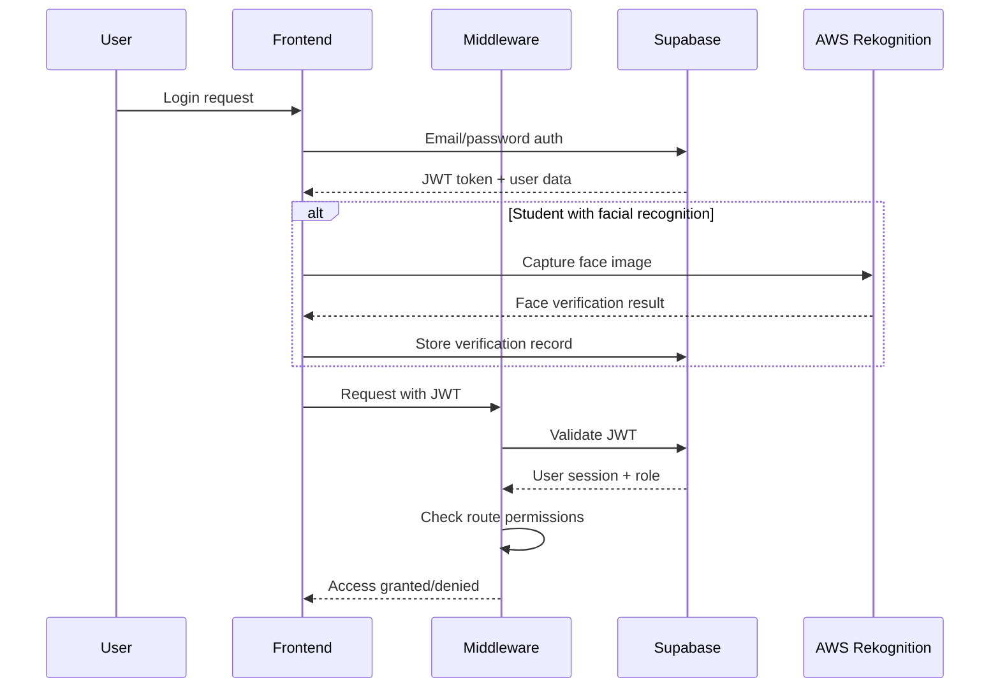

# Examica Architecture Documentation

This document outlines the technical architecture, design decisions, and system components for the Examica examination platform.

## System Overview

Examica is built as a modern, scalable web application using a serverless-first architecture with strong security and real-time capabilities powered by Next.js 15, Supabase, and AWS services.

### Architecture Diagram

```
┌─────────────────────────────────────────────────────────────────┐
│                          Frontend Layer                          │
│  ┌─────────────────┐  ┌─────────────────┐  ┌─────────────────┐ │
│  │   Admin Panel   │  │ Examiner Portal │  │ Student Portal  │ │
│  │   - User Mgmt   │  │  - Exam Creation │  │ - Take Exams   │ │
│  │   - Analytics   │  │  - Monitoring   │  │ - View Results │ │
│  │   - System Mgmt │  │  - Question Bank │  │ - Face Verify  │ │
│  └─────────────────┘  └─────────────────┘  └─────────────────┘ │
│                    Next.js 15 App Router                        │
│                 React 19 + TypeScript + Tailwind               │
└─────────────────────────────────────────────────────────────────┘
                                 │
                                 │ HTTPS/WebSocket
                                 ▼
┌─────────────────────────────────────────────────────────────────┐
│                     API & Middleware Layer                      │
│  ┌─────────────────┐  ┌─────────────────┐  ┌─────────────────┐ │
│  │  Auth Middleware │  │ Exam Security   │  │  Role Guards    │ │
│  │  (Supabase JWT) │  │   Middleware    │  │   (RLS)         │ │
│  └─────────────────┘  └─────────────────┘  └─────────────────┘ │
│                     Next.js API Routes                          │
└─────────────────────────────────────────────────────────────────┘
                                 │
        ┌───────────────────────┼───────────────────────┐
        ▼                       ▼                       ▼
┌─────────────────┐  ┌─────────────────┐  ┌─────────────────┐
│   Supabase      │  │   AWS Services   │  │ Email Services  │
│    Backend      │  │                 │  │                 │
│  ┌─────────────┐│  │  ┌─────────────┐│  │  ┌─────────────┐│
│  │ PostgreSQL  ││  │  │ Rekognition ││  │  │  AWS SES    ││
│  │   + RLS     ││  │  │ (Face Auth) ││  │  │   Resend    ││
│  └─────────────┘│  │  └─────────────┘│  │  │  Nodemailer ││
│  ┌─────────────┐│  │                 │  │  └─────────────┘│
│  │    Auth     ││  │                 │  │                 │
│  │   + Roles   ││  │                 │  │                 │
│  └─────────────┘│  │                 │  │                 │
│  ┌─────────────┐│  │                 │  │  ┌─────────────┐│
│  │Real-time DB ││  │                 │  │  │ AI Services ││
│  │Subscriptions││  │                 │  │  │OpenAI+Claude││
│  └─────────────┘│  │                 │  │  └─────────────┘│
└─────────────────┘  └─────────────────┘  └─────────────────┘
```

## Technology Stack Details

### Frontend Technology Stack

#### Next.js 15 (App Router)

- **Version**: 15.5.2 with React 19
- **Features Used**: App Router, Server Components, Client Components, API routes, Middleware
- **Configuration**: TypeScript strict mode, ESLint 9, Prettier with Husky pre-commit hooks
- **Rationale**: Server-side rendering, built-in API routes, excellent TypeScript support

#### React 19

- **State Management**: React hooks (useState, useEffect, useCallback) with custom hooks
- **Component Architecture**: Functional components with composition patterns
- **Performance**: React.memo, useMemo, useCallback for optimization
- **Custom Hooks**: useAuth, useUser, useFaceVerification for business logic

#### Tailwind CSS v4

- **Rationale**: Utility-first CSS framework with excellent developer experience
- **Configuration**: Custom design tokens, responsive design system
- **Architecture**: Atomic design principles with utility classes
- **Features**: Mobile-first responsive design, dark mode ready

#### TypeScript 5+

- **Configuration**: Strict mode enabled with absolute imports (@/lib, @/components)
- **Type Safety**: Full-stack type safety from database to UI
- **Database Types**: Auto-generated types from Supabase schema
- **Integration**: Comprehensive type definitions for all data models and API responses

### Backend & Infrastructure

#### Supabase (Backend-as-a-Service)

```typescript
// Actual Supabase Implementation
interface SupabaseConfig {
  database: {
    type: 'PostgreSQL'
    version: '13.0.4'
    features: [
      'RLS',
      'Real-time subscriptions',
      'JSONB support',
      'Generated columns',
    ]
  }
  authentication: {
    providers: ['Email/Password']
    security: ['JWT tokens', 'Row Level Security', 'Role-based access']
  }
  client_libraries: {
    ssr: '@supabase/ssr v0.7.0'
    client: '@supabase/supabase-js v2.56.1'
  }
  features_used: [
    'Real-time subscriptions',
    'RLS policies',
    'Triggers',
    'Functions',
  ]
}
```

#### Database Design

##### Current Database Schema

```sql
-- User Profiles (extends Supabase auth.users)
CREATE TABLE user_profiles (
  id UUID PRIMARY KEY REFERENCES auth.users(id),
  first_name VARCHAR NOT NULL,
  last_name VARCHAR NOT NULL,
  email VARCHAR,
  role user_role NOT NULL DEFAULT 'student',
  institution_id UUID,
  phone VARCHAR,
  avatar_url TEXT,
  face_image_url TEXT,
  metadata JSONB DEFAULT '{}'::jsonb,
  invited_by UUID,
  invitation_accepted_at TIMESTAMPTZ,
  created_at TIMESTAMPTZ DEFAULT now(),
  updated_at TIMESTAMPTZ DEFAULT now()
);

-- User Invitations System
CREATE TABLE user_invitations (
  id UUID PRIMARY KEY DEFAULT gen_random_uuid(),
  email VARCHAR NOT NULL,
  role user_role NOT NULL DEFAULT 'student',
  invitation_token VARCHAR NOT NULL,
  invited_by UUID NOT NULL,
  institution_id UUID,
  user_metadata JSONB,
  status invitation_status DEFAULT 'pending',
  expires_at TIMESTAMPTZ NOT NULL,
  accepted_at TIMESTAMPTZ,
  created_at TIMESTAMPTZ DEFAULT now(),
  updated_at TIMESTAMPTZ DEFAULT now()
);

-- Facial Recognition Data
CREATE TABLE facial_verifications (
  id UUID PRIMARY KEY DEFAULT gen_random_uuid(),
  user_id UUID NOT NULL REFERENCES auth.users(id),
  aws_face_id VARCHAR NOT NULL,
  confidence_score DECIMAL(5,2),
  enrollment_date TIMESTAMPTZ DEFAULT now(),
  is_active BOOLEAN DEFAULT true,
  verification_attempts JSONB DEFAULT '[]'::jsonb,
  created_at TIMESTAMPTZ DEFAULT now(),
  updated_at TIMESTAMPTZ DEFAULT now()
);

-- Exam Management
CREATE TABLE exams (
  id UUID PRIMARY KEY DEFAULT gen_random_uuid(),
  title VARCHAR NOT NULL,
  description TEXT,
  instructions TEXT,
  created_by UUID REFERENCES user_profiles(id),
  category VARCHAR,
  duration INTEGER, -- minutes
  max_attempts INTEGER DEFAULT 1,
  pass_threshold DECIMAL(5,2),
  requires_verification BOOLEAN DEFAULT false,
  show_results BOOLEAN DEFAULT true,
  shuffle_questions BOOLEAN DEFAULT false,
  status exam_status DEFAULT 'draft',
  metadata JSONB DEFAULT '{}'::jsonb,
  created_at TIMESTAMPTZ DEFAULT now(),
  updated_at TIMESTAMPTZ DEFAULT now()
);

-- Questions Bank
CREATE TABLE questions (
  id UUID PRIMARY KEY DEFAULT gen_random_uuid(),
  title VARCHAR NOT NULL,
  content TEXT NOT NULL,
  type question_type NOT NULL,
  difficulty VARCHAR DEFAULT 'medium' CHECK (difficulty IN ('easy', 'medium', 'hard')),
  category VARCHAR,
  tags VARCHAR[],
  options JSONB, -- For multiple choice, matching, etc.
  correct_answer JSONB NOT NULL,
  explanation TEXT,
  points INTEGER DEFAULT 1,
  ai_generated BOOLEAN DEFAULT false,
  ai_metadata JSONB,
  created_by UUID REFERENCES user_profiles(id),
  created_at TIMESTAMPTZ DEFAULT now(),
  updated_at TIMESTAMPTZ DEFAULT now()
);

-- Exam-Question Junction Table
CREATE TABLE exam_questions (
  id UUID PRIMARY KEY DEFAULT gen_random_uuid(),
  exam_id UUID REFERENCES exams(id) ON DELETE CASCADE,
  question_id UUID REFERENCES questions(id) ON DELETE CASCADE,
  order_index INTEGER NOT NULL,
  points INTEGER, -- Override question points for this exam
  required BOOLEAN DEFAULT true,
  created_at TIMESTAMPTZ DEFAULT now(),
  UNIQUE(exam_id, question_id),
  UNIQUE(exam_id, order_index)
);

-- Exam Sessions (Student Attempts)
CREATE TABLE exam_sessions (
  id UUID PRIMARY KEY DEFAULT gen_random_uuid(),
  exam_id UUID REFERENCES exams(id),
  user_id UUID REFERENCES user_profiles(id),
  started_at TIMESTAMPTZ DEFAULT now(),
  completed_at TIMESTAMPTZ,
  current_question_index INTEGER DEFAULT 0,
  time_remaining INTEGER, -- seconds
  answers JSONB DEFAULT '{}'::jsonb,
  metadata JSONB DEFAULT '{}'::jsonb,
  status session_status DEFAULT 'active',
  created_at TIMESTAMPTZ DEFAULT now(),
  updated_at TIMESTAMPTZ DEFAULT now()
);

-- Individual Question Responses
CREATE TABLE question_responses (
  id UUID PRIMARY KEY DEFAULT gen_random_uuid(),
  session_id UUID REFERENCES exam_sessions(id) ON DELETE CASCADE,
  question_id UUID REFERENCES questions(id),
  user_id UUID REFERENCES user_profiles(id),
  response JSONB, -- Student's response
  is_correct BOOLEAN,
  points_earned DECIMAL(5,2) DEFAULT 0,
  time_spent INTEGER, -- seconds
  attempts INTEGER DEFAULT 1,
  flagged BOOLEAN DEFAULT false,
  flag_reason TEXT,
  created_at TIMESTAMPTZ DEFAULT now(),
  updated_at TIMESTAMPTZ DEFAULT now(),
  UNIQUE(session_id, question_id)
);

-- Exam Results and Analytics
CREATE TABLE exam_results (
  id UUID PRIMARY KEY DEFAULT gen_random_uuid(),
  session_id UUID REFERENCES exam_sessions(id) ON DELETE CASCADE,
  user_id UUID REFERENCES user_profiles(id),
  exam_id UUID REFERENCES exams(id),
  total_score DECIMAL(5,2),
  max_possible_score DECIMAL(5,2),
  percentage_score DECIMAL(5,2),
  correct_answers INTEGER,
  total_questions INTEGER,
  time_spent INTEGER, -- seconds
  status VARCHAR DEFAULT 'in_progress',
  requires_manual_grading BOOLEAN DEFAULT false,
  started_at TIMESTAMPTZ,
  submitted_at TIMESTAMPTZ,
  completed_at TIMESTAMPTZ,
  graded_at TIMESTAMPTZ,
  graded_by UUID REFERENCES user_profiles(id),
  feedback TEXT,
  grader_notes TEXT,
  metadata JSONB,
  created_at TIMESTAMPTZ DEFAULT now(),
  updated_at TIMESTAMPTZ DEFAULT now(),
  UNIQUE(session_id)
);
```

##### Enums and Custom Types

```sql
CREATE TYPE user_role AS ENUM ('admin', 'examiner', 'student');
CREATE TYPE exam_status AS ENUM ('draft', 'published', 'active', 'completed', 'cancelled');
CREATE TYPE question_type AS ENUM ('multiple_choice', 'true_false', 'essay', 'fill_blank', 'matching');
CREATE TYPE session_status AS ENUM ('active', 'paused', 'submitted', 'flagged', 'terminated');
CREATE TYPE invitation_status AS ENUM ('pending', 'accepted', 'expired', 'cancelled');

-- Database Functions
CREATE OR REPLACE FUNCTION get_user_role(user_id UUID)
RETURNS user_role AS $$
BEGIN
  RETURN (SELECT role FROM user_profiles WHERE id = user_id);
END;
$$ LANGUAGE plpgsql SECURITY DEFINER;

CREATE OR REPLACE FUNCTION create_admin_profile(user_id UUID)
RETURNS TEXT AS $$
BEGIN
  -- Admin profile creation logic
  RETURN 'Admin profile created';
END;
$$ LANGUAGE plpgsql SECURITY DEFINER;
```

#### Row Level Security (RLS) Policies

```sql
-- Example RLS Policies
-- Users can only see their own profile
ALTER TABLE user_profiles ENABLE ROW LEVEL SECURITY;
CREATE POLICY "Users can view own profile" ON user_profiles
  FOR SELECT USING (auth.uid() = id);

-- Students can only see their own exam sessions
CREATE POLICY "Students view own sessions" ON exam_sessions
  FOR SELECT USING (auth.uid() = student_id);

-- Examiners can view sessions for their exams
CREATE POLICY "Examiners view exam sessions" ON exam_sessions
  FOR SELECT USING (
    EXISTS (
      SELECT 1 FROM exams
      WHERE exams.id = exam_sessions.exam_id
      AND exams.created_by = auth.uid()
    )
  );

-- Admins can view all sessions
CREATE POLICY "Admins view all sessions" ON exam_sessions
  FOR SELECT USING (
    EXISTS (
      SELECT 1 FROM users
      WHERE users.id = auth.uid()
      AND users.role = 'admin'
    )
  );
```

### External Service Integration

#### AWS Rekognition Integration

```typescript
// Actual AWS Rekognition Implementation
export class RekognitionService {
  private client: RekognitionClient

  constructor() {
    this.client = createRekognitionClient()
  }

  // Core facial recognition methods
  async compareFaces(
    sourceImageBase64: string,
    targetImageBase64: string
  ): Promise<FaceComparisonResult>

  async detectFaces(imageBase64: string): Promise<FaceDetectionResult>

  async validateFaceImage(imageBase64: string): Promise<{
    valid: boolean
    confidence?: number
    issues: string[]
  }>
}

// Configuration
export const SIMILARITY_THRESHOLD = 80 // 80% similarity threshold
export const CONFIDENCE_THRESHOLD = 90 // 90% confidence threshold

// Types
interface FaceComparisonResult {
  similarity: number
  confidence: number
  success: boolean
  error?: string
}

interface FaceDetectionResult {
  faceDetected: boolean
  confidence: number
  boundingBox?: {
    left: number
    top: number
    width: number
    height: number
  }
  error?: string
}
```

#### AI Services Integration

```typescript
// Actual AI Question Generator Implementation
class AIQuestionGenerator {
  private config = getEnvironmentConfig()

  async generateQuestions(
    request: QuestionGenerationRequest
  ): Promise<QuestionGenerationResult>

  private async generateWithAnthropic(
    request: QuestionGenerationRequest
  ): Promise<QuestionGenerationResult>

  private async generateWithOpenAI(
    request: QuestionGenerationRequest
  ): Promise<QuestionGenerationResult>

  async generateQuestionSet(
    topic: string,
    specifications: {
      easy: number
      medium: number
      hard: number
      types: QuestionType[]
      subject?: string
      context?: string
    }
  ): Promise<QuestionGenerationResult[]>
}

// Service Configuration
interface QuestionGenerationRequest {
  topic: string
  subject?: string
  type: QuestionType
  difficulty: QuestionDifficulty
  count?: number
  context?: string
  learningObjectives?: string[]
}

interface GeneratedQuestion {
  title: string
  content: string
  type: QuestionType
  difficulty: QuestionDifficulty
  options?: string[]
  correct_answer: string | number | boolean | string[]
  explanation: string
  points: number
  category?: string
  tags: string[]
  ai_metadata: {
    model: string
    prompt: string
    generated_at: string
    tokens_used?: number
  }
}

// Supported Models
// - Claude 3 Sonnet (Anthropic)
// - GPT-3.5 Turbo (OpenAI)
// Auto-fallback based on API key availability
```

#### Email Service Integration

```typescript
// Multi-provider Email Service
class EmailService {
  // Supported providers: AWS SES, Resend, SMTP, NoOp
  private getEmailProviderType(): EmailProviderType {
    // Auto-detect based on environment variables
    if (process.env.RESEND_API_KEY) return 'resend'
    if (process.env.AWS_ACCESS_KEY_ID) return 'ses'
    if (process.env.SMTP_HOST) return 'smtp'
    return 'none'
  }
}

// Email Providers
interface EmailProvider {
  sendInvitationEmail(params: SendInvitationEmailParams): Promise<EmailResult>
  sendPasswordResetEmail(email: string, resetUrl: string): Promise<EmailResult>
  isConfigured(): boolean
  getProviderName(): string
}

// Available: ResendProvider, SESEmailProvider, SMTPProvider, NoOpProvider
```

## Component Architecture

### Actual Frontend Component Hierarchy

```
src/
├── app/                       # Next.js 15 App Router
│   ├── (auth)/               # Auth layout group
│   │   ├── login/            # Login page
│   │   ├── register/         # Registration
│   │   ├── forgot-password/  # Password reset
│   │   ├── reset-password/   # Reset confirmation
│   │   ├── verify-email/     # Email verification
│   │   └── accept-invitation/ # User invitations
│   ├── admin/                # Admin portal
│   │   ├── users/            # User management
│   │   ├── exams/            # Exam administration
│   │   ├── monitor/          # System monitoring
│   │   └── page.tsx          # Admin dashboard
│   ├── examiner/             # Examiner portal
│   │   ├── exams/            # Exam management
│   │   ├── analytics/        # Analytics dashboard
│   │   ├── students/         # Student management
│   │   ├── results/          # Results overview
│   │   ├── create/           # Exam creation
│   │   └── page.tsx          # Examiner dashboard
│   ├── student/              # Student portal
│   │   └── page.tsx          # Student dashboard
│   ├── api/                  # API routes
│   │   ├── exam-sessions/    # Exam session management
│   │   ├── exam-results/     # Results API
│   │   ├── exams/            # Exam CRUD operations
│   │   ├── questions/        # Question management + AI generation
│   │   ├── users/            # User operations
│   │   ├── verify-identity/  # Face verification
│   │   └── get-invitations/  # User invitations
│   ├── globals.css           # Global styles
│   ├── layout.tsx            # Root layout
│   ├── page.tsx              # Home page
│   └── favicon.ico
├── components/               # Reusable components
│   ├── admin/                # Admin-specific components
│   │   ├── UserManagement.tsx
│   │   ├── UserInvitationsList.tsx
│   │   ├── FlaggedVerifications.tsx
│   │   └── InviteUserForm.tsx
│   ├── auth/                 # Authentication components
│   │   ├── LoginForm.tsx
│   │   ├── RegisterForm.tsx
│   │   ├── ForgotPasswordForm.tsx
│   │   ├── ResetPasswordForm.tsx
│   │   └── EmailVerificationHandler.tsx
│   ├── common/               # Shared components
│   │   ├── DashboardLayout.tsx
│   │   ├── Logo.tsx
│   │   ├── ProtectedRoute.tsx
│   │   ├── FaceCaptureCamera.tsx
│   │   ├── FaceImageUpload.tsx
│   │   └── FaceVerificationResult.tsx
│   ├── examiner/             # Examiner components
│   │   ├── ExamMonitorDashboard.tsx
│   │   ├── GenerateQuestionModal.tsx
│   │   ├── QuestionBank.tsx
│   │   └── QuestionCreationModal.tsx
│   ├── student/              # Student components
│   │   ├── FaceVerificationFlow.tsx
│   │   └── ProtectedExamAccess.tsx
│   ├── analytics/            # Analytics components
│   │   └── ExamAnalyticsDashboard.tsx
│   ├── layout/               # Layout components
│   │   ├── Header.tsx
│   │   ├── Footer.tsx
│   │   ├── Sidebar.tsx
│   │   └── index.ts
│   └── ui/                   # Basic UI components
│       ├── Button.tsx
│       ├── Card.tsx
│       ├── Input.tsx
│       └── index.ts
├── lib/                      # Utility libraries
│   ├── supabase/             # Supabase client setup
│   │   ├── client.ts         # Browser client
│   │   ├── server.ts         # Server client
│   │   └── middleware.ts     # Auth middleware
│   ├── aws/                  # AWS service integrations
│   │   ├── config.ts         # AWS configuration
│   │   ├── rekognition.ts    # Face recognition service
│   │   └── types.ts          # AWS types
│   ├── ai/                   # AI service integrations
│   │   └── question-generator.ts # AI question generation
│   ├── email/                # Email service providers
│   │   ├── service.ts        # Main email service
│   │   └── providers/        # Multiple email providers
│   ├── middleware/           # Custom middleware
│   │   └── examSecurity.ts   # Exam security middleware
│   ├── config/               # Configuration
│   │   └── validation.ts     # Environment validation
│   ├── auth.ts               # Authentication utilities
│   ├── design-tokens.ts      # Design system tokens
│   ├── theme.ts              # Theme configuration
│   └── invitations.ts        # User invitation logic
├── hooks/                    # Custom React hooks
│   ├── useAuth.ts            # Authentication hook
│   ├── useUser.ts            # User management hook
│   ├── useFaceVerification.ts # Face verification hook
│   └── index.ts
├── types/                    # TypeScript definitions
│   ├── database.types.ts     # Generated Supabase types
│   ├── database.ts           # Database utility types
│   ├── auth.ts               # Authentication types
│   └── ui.ts                 # UI component types
└── middleware.ts             # Next.js middleware
```

### Key Component Patterns

#### Compound Components Pattern

```typescript
// Example: Exam Builder Component
interface ExamBuilder {
  Root: React.FC<ExamBuilderProps>;
  Header: React.FC<HeaderProps>;
  QuestionList: React.FC<QuestionListProps>;
  Question: React.FC<QuestionProps>;
  Settings: React.FC<SettingsProps>;
  Actions: React.FC<ActionsProps>;
}

// Usage
<ExamBuilder.Root>
  <ExamBuilder.Header />
  <ExamBuilder.QuestionList>
    {questions.map(question => (
      <ExamBuilder.Question key={question.id} {...question} />
    ))}
  </ExamBuilder.QuestionList>
  <ExamBuilder.Settings />
  <ExamBuilder.Actions />
</ExamBuilder.Root>
```

#### Current Custom Hooks Implementation

```typescript
// Authentication hook (src/hooks/useAuth.ts)
export function useAuth() {
  const [user, setUser] = useState<User | null>(null)
  const [loading, setLoading] = useState(true)
  const supabase = createClient()

  useEffect(() => {
    // Get initial session
    const getSession = async () => {
      const {
        data: { session },
      } = await supabase.auth.getSession()
      setUser(session?.user ?? null)
      setLoading(false)
    }

    getSession()

    // Listen for auth changes
    const {
      data: { subscription },
    } = supabase.auth.onAuthStateChange((_event, session) => {
      setUser(session?.user ?? null)
      setLoading(false)
    })

    return () => subscription.unsubscribe()
  }, [])

  return {
    user,
    loading,
    signOut: () => supabase.auth.signOut(),
  }
}

// User profile hook (src/hooks/useUser.ts)
export function useUser() {
  const { user } = useAuth()
  const [profile, setProfile] = useState<UserProfile | null>(null)
  const [loading, setLoading] = useState(true)
  const supabase = createClient()

  useEffect(() => {
    if (user) {
      fetchProfile()
    } else {
      setProfile(null)
      setLoading(false)
    }
  }, [user])

  const fetchProfile = async () => {
    const { data, error } = await supabase
      .from('user_profiles')
      .select('*')
      .eq('id', user!.id)
      .single()

    if (!error) {
      setProfile(data)
    }
    setLoading(false)
  }

  return { profile, loading, refetch: fetchProfile }
}

// Face verification hook (src/hooks/useFaceVerification.ts)
export function useFaceVerification() {
  const [isVerifying, setIsVerifying] = useState(false)
  const [verificationResult, setVerificationResult] =
    useState<VerificationResult | null>(null)

  const verifyFace = async (imageData: string) => {
    setIsVerifying(true)
    try {
      const response = await fetch('/api/verify-identity', {
        method: 'POST',
        headers: { 'Content-Type': 'application/json' },
        body: JSON.stringify({ imageData }),
      })
      const result = await response.json()
      setVerificationResult(result)
      return result
    } catch (error) {
      console.error('Face verification failed:', error)
      return { success: false, error: 'Verification failed' }
    } finally {
      setIsVerifying(false)
    }
  }

  return {
    verifyFace,
    isVerifying,
    verificationResult,
    clearResult: () => setVerificationResult(null),
  }
}
```

#### Component Patterns Used

```typescript
// Dashboard Layout Pattern (src/components/common/DashboardLayout.tsx)
interface DashboardLayoutProps {
  children: React.ReactNode
  user?: UserProfile
  showSidebar?: boolean
}

export function DashboardLayout({ children, user, showSidebar = true }: DashboardLayoutProps) {
  return (
    <div className="min-h-screen bg-gray-50">
      <Header user={user} />
      <div className="flex">
        {showSidebar && <Sidebar userRole={user?.role} />}
        <main className="flex-1 p-6">
          {children}
        </main>
      </div>
    </div>
  )
}

// Protected Route Pattern (src/components/common/ProtectedRoute.tsx)
interface ProtectedRouteProps {
  children: React.ReactNode
  allowedRoles: UserRole[]
  requireVerification?: boolean
}

export function ProtectedRoute({
  children,
  allowedRoles,
  requireVerification = false
}: ProtectedRouteProps) {
  const { user, loading } = useAuth()
  const { profile } = useUser()

  if (loading) return <LoadingSpinner />
  if (!user) return <Navigate to="/login" />
  if (!allowedRoles.includes(profile?.role)) return <UnauthorizedPage />

  if (requireVerification && profile?.role === 'student') {
    return <FaceVerificationFlow>{children}</FaceVerificationFlow>
  }

  return <>{children}</>
}
```

## Security Architecture

### Authentication & Authorization Flow



### Data Protection Strategy

#### Encryption at Rest

- Database: Supabase uses AES-256 encryption
- File Storage: AWS S3 server-side encryption
- Biometric Data: Encrypted with customer-managed keys

#### Encryption in Transit

- All communications use TLS 1.3
- WebSocket connections secured with WSS
- API calls require HTTPS

#### Privacy Controls

```typescript
interface PrivacySettings {
  biometric_data: {
    retention_period: '2_years'
    auto_delete: true
    user_consent_required: true
    data_portability: true
  }
  exam_recordings: {
    retention_period: '1_year'
    admin_access_only: true
    audit_log_required: true
  }
  performance_data: {
    anonymization_after: '5_years'
    aggregated_analytics: true
    individual_deletion_right: true
  }
}
```

## Performance Architecture

### Caching Strategy

#### Multi-Level Caching

```typescript
interface CachingLayers {
  browser: {
    static_assets: 'Service Worker + Cache API'
    api_responses: 'SWR with localStorage'
    user_preferences: 'IndexedDB'
  }
  cdn: {
    provider: 'Vercel Edge Network'
    static_content: '1 year cache'
    dynamic_content: '5 minute cache'
  }
  database: {
    query_cache: 'Supabase built-in'
    session_data: 'Redis (future enhancement)'
    computed_results: 'Materialized views'
  }
}
```

#### Database Optimization

```sql
-- Critical indexes for performance
CREATE INDEX idx_exam_sessions_student_exam ON exam_sessions(student_id, exam_id);
CREATE INDEX idx_exam_sessions_exam_status ON exam_sessions(exam_id, status);
CREATE INDEX idx_questions_exam_order ON questions(exam_id, order_index);
CREATE INDEX idx_exam_results_session ON exam_results(session_id);
CREATE INDEX idx_facial_verifications_user_active ON facial_verifications(user_id, is_active);

-- Partial indexes for active sessions
CREATE INDEX idx_active_exam_sessions ON exam_sessions(exam_id, started_at)
WHERE status = 'active';

-- Composite indexes for analytics
CREATE INDEX idx_results_analytics ON exam_results(calculated_at, percentage)
INCLUDE (session_id);
```

### Real-time Architecture

#### WebSocket Connections

```typescript
interface RealtimeChannels {
  exam_monitoring: {
    channel: `exam:${examId}`
    events: ['student_join', 'student_leave', 'flag_raised', 'submission']
    subscribers: ['proctors', 'admins']
  }
  system_status: {
    channel: 'system'
    events: ['server_health', 'maintenance_mode']
    subscribers: ['all_authenticated_users']
  }
  student_exam: {
    channel: `student:${studentId}:${examId}`
    events: ['time_update', 'auto_save', 'proctor_message']
    subscribers: ['student', 'assigned_proctor']
  }
}
```

## Scalability Considerations

### Horizontal Scaling Strategy

#### Database Scaling

```typescript
interface DatabaseScaling {
  read_replicas: {
    analytics_queries: 'Dedicated read replica'
    real_time_monitoring: 'Separate connection pool'
    reporting: 'Data warehouse integration'
  }
  connection_pooling: {
    max_connections: 100
    pool_size: 20
    timeout: '30s'
  }
  query_optimization: {
    prepared_statements: true
    query_plan_caching: true
    automatic_vacuuming: true
  }
}
```

#### Application Scaling

- **Stateless Design**: All session data stored in database
- **Edge Functions**: Use Supabase Edge Functions for compute-heavy tasks
- **CDN Integration**: Static assets served from global CDN
- **Load Balancing**: Automatic with Vercel/Next.js deployment

### Monitoring & Observability

#### Key Metrics to Track

```typescript
interface SystemMetrics {
  performance: {
    response_time_p95: '<200ms'
    database_query_time: '<100ms'
    facial_recognition_latency: '<2s'
    exam_load_time: '<3s'
  }
  reliability: {
    uptime: '>99.9%'
    error_rate: '<0.1%'
    failed_login_rate: '<5%'
  }
  business: {
    concurrent_exam_takers: 'real-time'
    exam_completion_rate: '>95%'
    user_satisfaction_score: '>4.5/5'
  }
}
```

#### Alerting Strategy

- **Critical**: System down, database connection lost, authentication failures >10%
- **Warning**: High response times, increased error rates, storage approaching limits
- **Info**: New user registrations, exam completions, performance improvements

## Development & Deployment

### Current Technology Versions

```json
{
  "runtime": {
    "node": ">=18.0.0",
    "next": "15.5.2",
    "react": "19.1.0",
    "typescript": "^5"
  },
  "main_dependencies": {
    "@supabase/ssr": "^0.7.0",
    "@supabase/supabase-js": "^2.56.1",
    "@aws-sdk/client-rekognition": "^3.879.0",
    "@aws-sdk/client-ses": "^3.886.0",
    "tailwindcss": "^4",
    "lucide-react": "^0.542.0",
    "clsx": "^2.1.1",
    "tailwind-merge": "^3.3.1"
  },
  "dev_tools": {
    "eslint": "^9",
    "prettier": "^3.6.2",
    "husky": "^9.1.7",
    "lint-staged": "^16.1.5"
  }
}
```

### Development Scripts

```json
{
  "dev": "next dev",
  "build": "next build",
  "start": "next start",
  "lint": "next lint",
  "type-check": "tsc --noEmit",
  "prepare": "husky",
  "seed:admin": "node scripts/seed-admin.mjs"
}
```

### Environment Configuration

```typescript
interface EnvironmentConfig {
  required: {
    NEXT_PUBLIC_SUPABASE_URL: string
    NEXT_PUBLIC_SUPABASE_ANON_KEY: string
    SUPABASE_SERVICE_ROLE_KEY: string
  }
  optional: {
    // AWS Services
    AWS_ACCESS_KEY_ID?: string
    AWS_SECRET_ACCESS_KEY?: string
    AWS_REGION?: string

    // AI Services
    ANTHROPIC_API_KEY?: string
    OPENAI_API_KEY?: string

    // Email Services
    EMAIL_PROVIDER?: 'ses' | 'resend' | 'smtp' | 'none'
    RESEND_API_KEY?: string
    SMTP_HOST?: string
    SMTP_PORT?: string
    SMTP_USER?: string
    SMTP_PASS?: string

    // Redis (optional caching)
    REDIS_URL?: string
  }
}
```

### Code Quality & Standards

- **ESLint Configuration**: Next.js recommended rules + custom rules
- **Prettier**: Consistent code formatting with pre-commit hooks
- **TypeScript**: Strict mode enabled for type safety
- **Husky**: Pre-commit hooks for linting and formatting
- **Lint-staged**: Only lint changed files for faster commits

### Key Features Implemented

✅ **Multi-role Authentication**: Admin, Examiner, Student roles with RLS
✅ **Face Recognition**: AWS Rekognition integration for student verification
✅ **AI Question Generation**: Claude/OpenAI integration for exam creation
✅ **Real-time Monitoring**: Supabase real-time subscriptions
✅ **Email System**: Multi-provider email service (SES, Resend, SMTP)
✅ **User Invitations**: Complete invitation workflow
✅ **Exam Management**: Full CRUD with question bank
✅ **Results & Analytics**: Detailed performance tracking
✅ **Security**: Row Level Security, JWT authentication, role-based access

This architecture provides a solid foundation for building a scalable, secure, and performant examination platform while maintaining flexibility for future enhancements and integrations.
