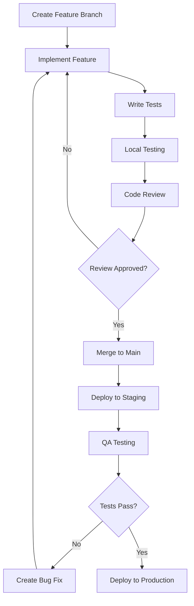

# Examica Development Workflows

This document defines the development workflows, processes, and best practices for the Examica project.

## Development Workflow Overview

### Git Workflow Strategy

We use **GitHub Flow** - a simplified branching strategy optimized for continuous deployment:

```
main (production-ready)
├── feature/user-authentication
├── feature/exam-creation-ui  
├── feature/facial-recognition
├── hotfix/security-patch
└── docs/update-readme
```

#### Branch Naming Conventions
- **Features**: `feature/description-of-feature`
- **Bug fixes**: `bugfix/issue-description`  
- **Hotfixes**: `hotfix/critical-issue`
- **Documentation**: `docs/what-is-being-documented`
- **Experiments**: `experiment/what-youre-trying`

#### Commit Message Format
```
<type>(<scope>): <description>

[optional body]

[optional footer]
```

**Types**: `feat`, `fix`, `docs`, `style`, `refactor`, `test`, `chore`

**Examples**:
```
feat(auth): add facial recognition enrollment flow
fix(exam): resolve timer not updating in real-time  
docs(api): update authentication endpoint documentation
test(dashboard): add unit tests for analytics components
```

### Development Process

#### 1. Feature Development Workflow



#### 2. Daily Development Routine

**Morning Setup**:
```bash
# Pull latest changes
git checkout main
git pull origin main

# Create feature branch
git checkout -b feature/your-feature-name

# Install dependencies (if needed)
npm install

# Start development server
npm run dev
```

**Development Loop**:
1. Write failing test (if TDD)
2. Implement feature/fix
3. Run tests: `npm test`
4. Run linting: `npm run lint`
5. Type check: `npm run type-check`
6. Commit changes with descriptive message

**End of Day**:
```bash
# Push current work
git add .
git commit -m "wip: working on feature implementation"
git push origin feature/your-feature-name
```

#### 3. Code Review Process

**Before Creating PR**:
- [ ] All tests pass locally
- [ ] No linting errors
- [ ] TypeScript type checking passes
- [ ] Feature is fully implemented according to requirements
- [ ] Documentation updated (if needed)

**PR Template**:
```markdown
## Description
Brief description of changes

## Type of Change
- [ ] Bug fix
- [ ] New feature  
- [ ] Breaking change
- [ ] Documentation update

## Testing
- [ ] Unit tests added/updated
- [ ] Integration tests pass
- [ ] Manual testing completed

## Screenshots (if applicable)
[Add screenshots here]

## Checklist
- [ ] Code follows project style guidelines
- [ ] Self-review completed
- [ ] Tests added for new functionality
- [ ] Documentation updated
```

**Review Criteria**:
- Code quality and readability
- Test coverage and quality
- Security considerations
- Performance implications
- Accessibility compliance
- Mobile responsiveness

## Testing Strategy

### Testing Pyramid

```
    ┌─────────────┐
    │     E2E     │ <- Few, high-level tests
    │    Tests    │
    ├─────────────┤
    │ Integration │ <- More tests, API/DB integration
    │    Tests    │
    ├─────────────┤
    │    Unit     │ <- Most tests, individual functions
    │   Tests     │
    └─────────────┘
```

### Test Organization

```
__tests__/
├── unit/                    # Unit tests
│   ├── components/          # React component tests
│   ├── hooks/              # Custom hook tests
│   ├── utils/              # Utility function tests
│   └── lib/                # Library/service tests
├── integration/             # Integration tests
│   ├── api/                # API route tests
│   ├── database/           # Database operation tests
│   └── auth/               # Authentication flow tests
└── e2e/                    # End-to-end tests
    ├── admin/              # Admin user journeys
    ├── examiner/           # Examiner workflows
    └── student/            # Student exam experience
```

### Testing Commands

```bash
# Run all tests
npm test

# Run tests in watch mode
npm run test:watch

# Run tests with coverage
npm run test:coverage

# Run E2E tests
npm run test:e2e

# Run specific test file
npm test -- auth.test.ts

# Run tests for changed files only
npm test -- --onlyChanged
```

### Test Writing Guidelines

#### Unit Test Example
```typescript
// __tests__/unit/utils/exam-score.test.ts
import { calculateExamScore } from '../../../lib/utils/exam-score';

describe('calculateExamScore', () => {
  it('should calculate correct percentage for all correct answers', () => {
    const answers = [
      { questionId: '1', correct: true, marks: 2 },
      { questionId: '2', correct: true, marks: 3 }
    ];
    
    const result = calculateExamScore(answers);
    
    expect(result.percentage).toBe(100);
    expect(result.totalMarks).toBe(5);
    expect(result.scoredMarks).toBe(5);
  });

  it('should handle partial marks for essay questions', () => {
    const answers = [
      { questionId: '1', correct: true, marks: 2, scoredMarks: 1.5 }
    ];
    
    const result = calculateExamScore(answers);
    
    expect(result.percentage).toBe(75);
  });
});
```

#### Component Test Example  
```typescript
// __tests__/unit/components/ExamTimer.test.tsx
import { render, screen, act } from '@testing-library/react';
import { ExamTimer } from '../../../components/exam/ExamTimer';

describe('ExamTimer', () => {
  beforeEach(() => {
    jest.useFakeTimers();
  });

  afterEach(() => {
    jest.useRealTimers();
  });

  it('should display remaining time correctly', () => {
    render(<ExamTimer duration={3600} onTimeUp={jest.fn()} />);
    
    expect(screen.getByText('60:00')).toBeInTheDocument();
  });

  it('should call onTimeUp when timer reaches zero', () => {
    const onTimeUp = jest.fn();
    render(<ExamTimer duration={1} onTimeUp={onTimeUp} />);
    
    act(() => {
      jest.advanceTimersByTime(1000);
    });
    
    expect(onTimeUp).toHaveBeenCalled();
  });
});
```

#### Integration Test Example
```typescript
// __tests__/integration/api/exams.test.ts
import { createMocks } from 'node-mocks-http';
import handler from '../../../pages/api/exams';
import { createClient } from '../../../lib/supabase';

jest.mock('../../../lib/supabase');

describe('/api/exams', () => {
  it('should create exam for authenticated examiner', async () => {
    const { req, res } = createMocks({
      method: 'POST',
      headers: {
        authorization: 'Bearer valid-token'
      },
      body: {
        title: 'Math Test',
        duration: 60,
        questions: []
      }
    });

    await handler(req, res);

    expect(res._getStatusCode()).toBe(201);
    expect(JSON.parse(res._getData())).toMatchObject({
      title: 'Math Test',
      duration: 60
    });
  });
});
```

## CI/CD Pipeline

### GitHub Actions Workflow

```yaml
# .github/workflows/ci.yml
name: CI/CD Pipeline

on:
  push:
    branches: [ main, develop ]
  pull_request:
    branches: [ main ]

jobs:
  test:
    runs-on: ubuntu-latest
    
    steps:
    - uses: actions/checkout@v3
    
    - name: Setup Node.js
      uses: actions/setup-node@v3
      with:
        node-version: '18'
        cache: 'npm'
    
    - name: Install dependencies
      run: npm ci
    
    - name: Run linting
      run: npm run lint
    
    - name: Run type checking
      run: npm run type-check
    
    - name: Run unit tests
      run: npm run test:coverage
    
    - name: Run E2E tests
      run: npm run test:e2e
    
    - name: Upload coverage
      uses: codecov/codecov-action@v3

  deploy-staging:
    needs: test
    runs-on: ubuntu-latest
    if: github.ref == 'refs/heads/develop'
    
    steps:
    - name: Deploy to Staging
      run: |
        # Deploy to staging environment
        vercel --prod --token ${{ secrets.VERCEL_TOKEN }}

  deploy-production:
    needs: test
    runs-on: ubuntu-latest
    if: github.ref == 'refs/heads/main'
    
    steps:
    - name: Deploy to Production
      run: |
        # Deploy to production
        vercel --prod --token ${{ secrets.VERCEL_TOKEN }}
```

### Deployment Environments

#### Staging Environment
- **URL**: `https://examica-staging.vercel.app`
- **Purpose**: QA testing, client demos, integration testing
- **Data**: Anonymized test data, safe to reset
- **Auto-deploy**: On push to `develop` branch

#### Production Environment  
- **URL**: `https://examica.app`
- **Purpose**: Live application for end users
- **Data**: Real user data, requires careful handling
- **Deploy**: Manual approval after staging validation

## Code Quality Standards

### Linting Configuration

```json
// .eslintrc.json
{
  "extends": [
    "next/core-web-vitals",
    "@typescript-eslint/recommended",
    "prettier"
  ],
  "rules": {
    "no-unused-vars": "error",
    "no-console": "warn",
    "@typescript-eslint/no-explicit-any": "error",
    "react-hooks/exhaustive-deps": "error",
    "import/order": ["error", {
      "groups": [
        "builtin",
        "external", 
        "internal",
        "parent",
        "sibling",
        "index"
      ]
    }]
  }
}
```

### Prettier Configuration

```json
// .prettierrc
{
  "semi": true,
  "trailingComma": "es5",
  "singleQuote": true,
  "printWidth": 80,
  "tabWidth": 2,
  "useTabs": false
}
```

### TypeScript Configuration

```json
// tsconfig.json
{
  "compilerOptions": {
    "target": "es5",
    "lib": ["dom", "dom.iterable", "es6"],
    "allowJs": true,
    "skipLibCheck": true,
    "strict": true,
    "forceConsistentCasingInFileNames": true,
    "noEmit": true,
    "esModuleInterop": true,
    "module": "esnext",
    "moduleResolution": "node",
    "resolveJsonModule": true,
    "isolatedModules": true,
    "jsx": "preserve",
    "incremental": true,
    "plugins": [
      {
        "name": "next"
      }
    ],
    "baseUrl": ".",
    "paths": {
      "@/*": ["./*"],
      "@/components/*": ["./components/*"],
      "@/lib/*": ["./lib/*"],
      "@/types/*": ["./types/*"]
    }
  },
  "include": ["next-env.d.ts", "**/*.ts", "**/*.tsx", ".next/types/**/*.ts"],
  "exclude": ["node_modules"]
}
```

## Security Workflows

### Security Review Process

#### Pre-commit Security Checks
```bash
# Run security audit
npm audit

# Check for secrets in code
npm run check-secrets

# Run security linting
npm run lint:security
```

#### Security Testing Checklist
- [ ] Input validation on all forms
- [ ] SQL injection prevention (parameterized queries)
- [ ] XSS protection (sanitized inputs/outputs)
- [ ] CSRF protection enabled
- [ ] Authentication bypass attempts tested
- [ ] Authorization bypass attempts tested
- [ ] Rate limiting tested
- [ ] File upload security tested

### Dependency Management

#### Automated Dependency Updates
```yaml
# .github/dependabot.yml
version: 2
updates:
  - package-ecosystem: "npm"
    directory: "/"
    schedule:
      interval: "weekly"
    reviewers:
      - "team-leads"
    assignees:
      - "tech-lead"
    commit-message:
      prefix: "chore"
      include: "scope"
```

#### Security Monitoring
- **Snyk**: Automated vulnerability scanning
- **GitHub Security Advisories**: Automatic PR creation for fixes
- **npm audit**: Regular dependency security auditing

## Performance Monitoring Workflow

### Performance Testing Process

#### Lighthouse CI Integration
```yaml
# .github/workflows/lighthouse.yml
name: Lighthouse CI
on: [push]
jobs:
  lighthouse:
    runs-on: ubuntu-latest
    steps:
      - uses: actions/checkout@v3
      - name: Run Lighthouse CI
        run: |
          npm install -g @lhci/cli@0.11.x
          lhci autorun
        env:
          LHCI_GITHUB_APP_TOKEN: ${{ secrets.LHCI_GITHUB_APP_TOKEN }}
```

#### Performance Budget
```json
// lighthouse.json  
{
  "ci": {
    "collect": {
      "url": ["http://localhost:3000"],
      "startServerCommand": "npm run start"
    },
    "assert": {
      "assertions": {
        "categories:performance": ["error", {"minScore": 0.8}],
        "categories:accessibility": ["error", {"minScore": 0.9}],
        "categories:best-practices": ["error", {"minScore": 0.9}],
        "categories:seo": ["error", {"minScore": 0.9}]
      }
    }
  }
}
```

### Monitoring & Alerting

#### Key Performance Indicators (KPIs)
```typescript
interface PerformanceKPIs {
  core_web_vitals: {
    FCP: '<1.8s',  // First Contentful Paint
    LCP: '<2.5s',  // Largest Contentful Paint  
    FID: '<100ms', // First Input Delay
    CLS: '<0.1'    // Cumulative Layout Shift
  },
  custom_metrics: {
    exam_load_time: '<3s',
    question_navigation: '<500ms',
    auto_save_response: '<200ms',
    facial_recognition: '<2s'
  }
}
```

#### Error Tracking & Logging
```typescript
// lib/error-tracking.ts
import * as Sentry from '@sentry/nextjs';

export const errorTracker = {
  init: () => {
    Sentry.init({
      dsn: process.env.SENTRY_DSN,
      environment: process.env.NODE_ENV,
      tracesSampleRate: 1.0
    });
  },
  
  captureError: (error: Error, context?: Record<string, any>) => {
    Sentry.withScope(scope => {
      if (context) {
        scope.setContext('additional_info', context);
      }
      Sentry.captureException(error);
    });
  },
  
  captureMessage: (message: string, level: 'info' | 'warning' | 'error') => {
    Sentry.captureMessage(message, level);
  }
};
```

## Documentation Workflow

### Documentation Standards

#### Code Documentation
- **JSDoc**: For functions and complex logic
- **README**: Setup and basic usage instructions
- **API Docs**: Auto-generated from OpenAPI specs
- **Component Docs**: Storybook for UI components

#### Documentation Review Process
1. Documentation created alongside feature development
2. Technical review by peer developer
3. User experience review by product team
4. Final review by technical writer (if available)

### Storybook Integration

```typescript
// .storybook/main.ts
import type { StorybookConfig } from '@storybook/nextjs';

const config: StorybookConfig = {
  stories: ['../components/**/*.stories.@(js|jsx|ts|tsx)'],
  addons: [
    '@storybook/addon-essentials',
    '@storybook/addon-interactions',
    '@storybook/addon-a11y'
  ],
  framework: {
    name: '@storybook/nextjs',
    options: {}
  }
};

export default config;
```

This comprehensive workflow documentation ensures consistent development practices, high code quality, and efficient collaboration across the Examica project team.